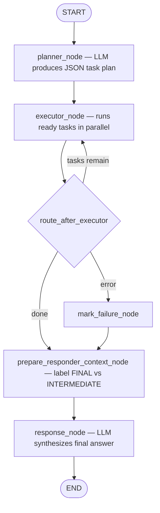
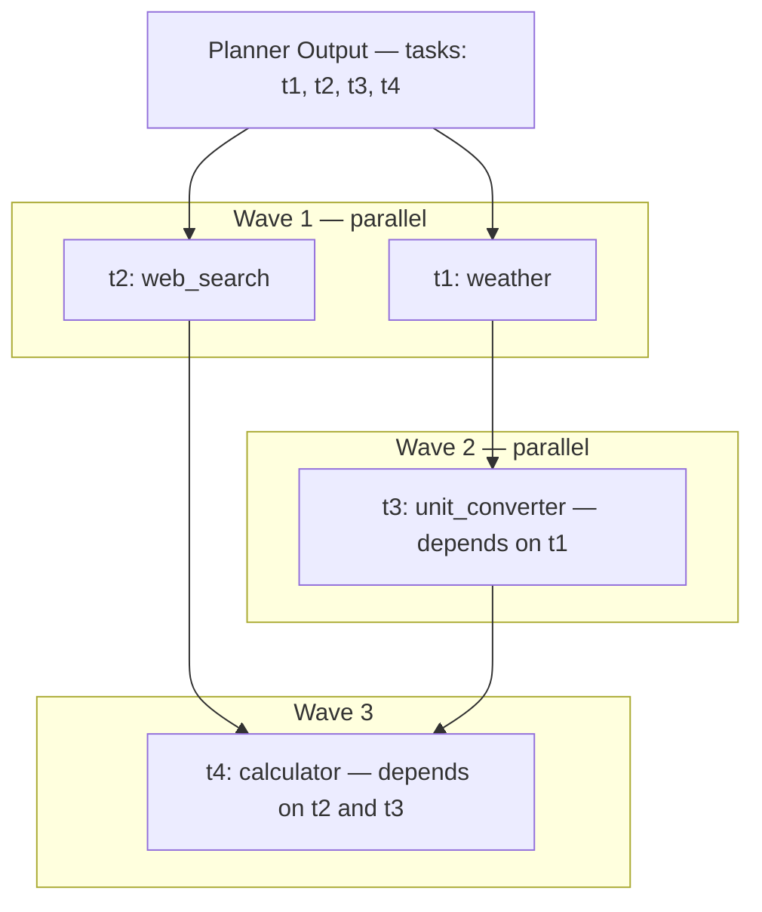
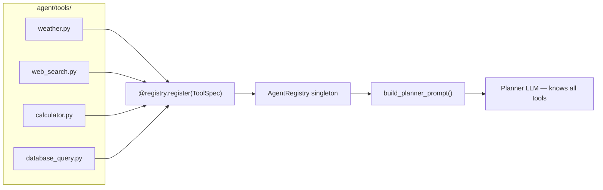
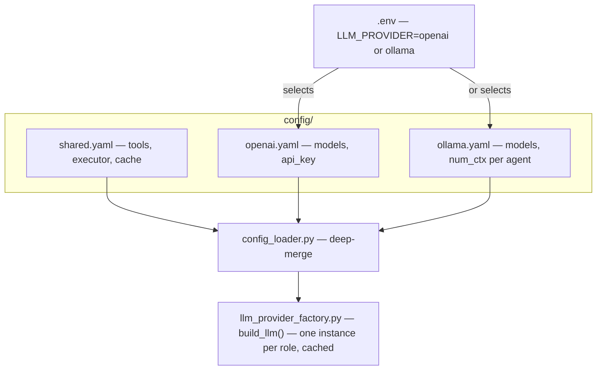

# System Design — LangGraph Agent

[← Component README](README.md) · [Code Design →](02-code-design.md)

---

## What Kind of Agent

This is a **plan-and-execute** agent, not a ReAct loop.

The three roles never overlap:

| Role | Job | Output |
|------|-----|--------|
| **Planner** | Decides which tools to run, in what order, with what parameters | JSON task plan |
| **Executor** | Runs tools in parallel waves, respects dependencies | Structured results + trace |
| **Responder** | Synthesizes a human-readable answer from tool outputs | Final text answer |

The planner never speaks to the user. The responder never calls tools. The executor never reasons.

---

## Execution Graph



> The `prepare_responder_context_node` labels each tool result as **FINAL ANSWER** (no downstream task depends on it) or **INTERMEDIATE** (fed data into another tool). The responder uses these labels to know which numbers to present vs. which to treat as background context.

---

## Fan-Out / Fan-In Wave Architecture

The planner emits a dependency-aware task list using `depends_on` arrays, forming a DAG.



**Fan-out** — every task whose `depends_on` list is fully satisfied runs concurrently via `asyncio.gather`.  
**Fan-in** — results merge back into shared graph state, unlocking the next wave.

Independent tools never wait for each other. Dependent tools always receive their upstream data before running.

---

## Plugin / Factory Tool System

Tools are registered automatically at startup — the planner prompt is generated from whatever is in the registry.



Adding a new tool requires only creating a `.py` file in `agent/tools/` with the decorator — nothing else changes.

Tools can be enabled or disabled via `config/shared.yaml`:

```yaml
tools:
  weather:
    enabled: true
  my_new_tool:
    enabled: false   # skipped during discovery
```

---

## Externalized Provider Configuration

The provider is selected at process start from `.env` and never changes at runtime.



Each agent role (planner, responder, every tool) can use a **different model**, configured entirely in YAML.
