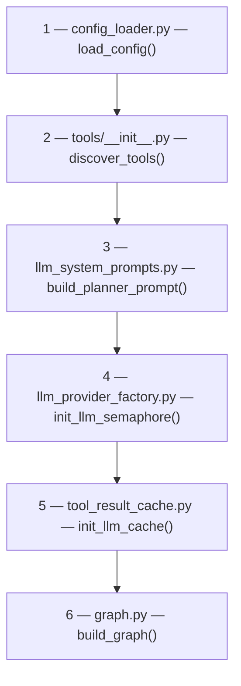
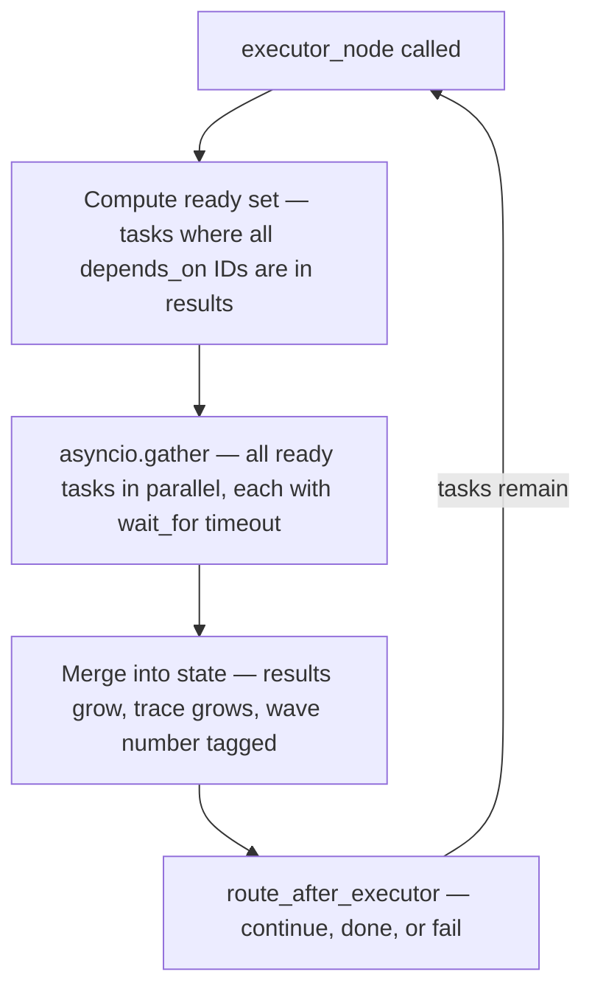
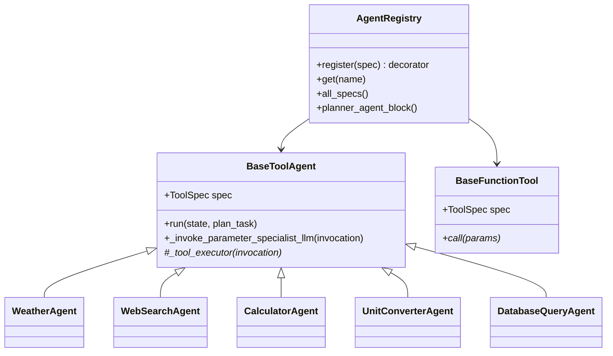
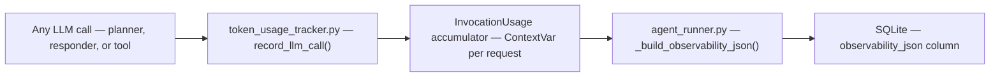

# Code Design — LangGraph Agent

[← Component README](README.md) · [← System Design](01-system-design.md) · [Folder Structure →](03-folder-structure.md)

---

## Startup Sequence

Startup order is enforced because each step depends on the previous one being complete.



**Entry point:** `agent/startup_initialization.py → startup()`

---

## Planner Node

**File:** `agent/graph_nodes.py :: planner_node`

The planner receives a bounded context package and produces a structured execution plan.

| Input | Source |
|-------|--------|
| User task | Graph state `task` field |
| Recent messages (≤ 5 turns) | `conversation_memory.py` snapshot |
| Conversation summary | Rolling summary from background summarizer |
| Tools used last turn | `conversation_context.last_tools_used` |

**Output:** a JSON plan passed directly into `results`:
```json
{
  "tasks": [
    { "id": "t1", "agent": "weather", "type": "llm", "sub_task": "...", "params": {}, "depends_on": [] },
    { "id": "t2", "agent": "calculator", "type": "llm", "sub_task": "...", "params": {}, "depends_on": ["t1"] }
  ]
}
```

Memory injected into the planner is **token-budgeted** by `memory_budget_formatter.py` (≤ 500 tokens).

---

## Executor Node

**File:** `agent/graph_nodes.py :: executor_node`

Each call to the executor processes **one wave** — all tasks whose dependencies are already complete.



Each tool in the ready set is dispatched as:
- **LLM tool** → `agent.run(state, plan_task)` — tool builds a `ToolInvocation` and calls its LLM if needed
- **Function tool** → `agent.call(params)` — pure computation, no LLM involved

---

## Tool System (Base Classes)

**File:** `agent/tools/tool_base_classes.py`



All current tools inherit from `BaseToolAgent` because they all need an LLM to extract parameters — especially for **dependent tasks**, where params must be resolved from a prior tool's unstructured output.

`BaseFunctionTool` exists as an extension point for future tools where the planner can always supply complete, typed params directly (no LLM extraction step needed). None of the current tools use it.

---

## Responder Node

**File:** `agent/graph_nodes.py :: response_node`

Before the responder runs, `prepare_responder_context_node` classifies every result:

- **FINAL ANSWER** — no other task depends on this output → the responder bases its reply here
- **INTERMEDIATE** — this output was consumed by another tool → treated as background context only

The responder's system prompt (`RESPONDER_SYSTEM`) enforces that it never re-derives a result already produced by a tool.

---

## Observability Chain

Every LLM call records tokens and I/O via `token_usage_tracker.py`.



The full `observability_json` is retrievable via `GET /api/v1/tasks/{id}` and the debug endpoint.
