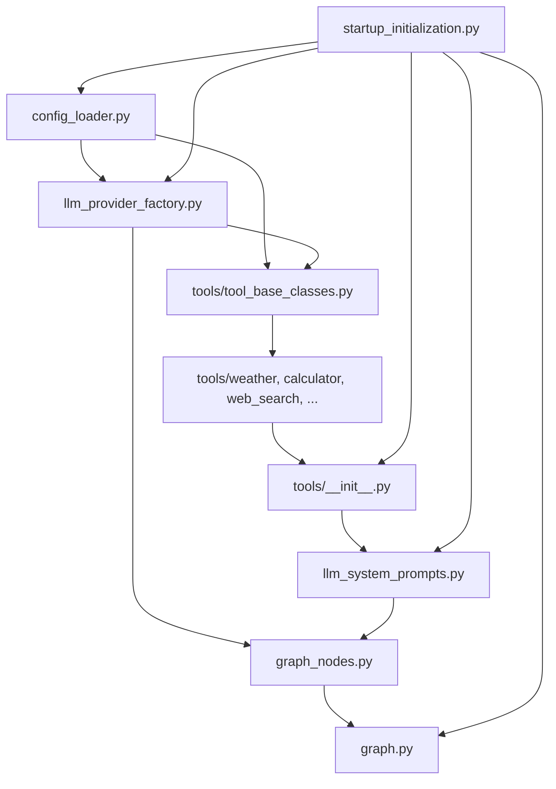

# Folder Structure — LangGraph Agent

[← Component README](README.md) · [← Code Design](02-code-design.md)

---

## `agent/` Tree

```
agent/
│
├── startup_initialization.py    ← Ordered startup sequence + config validation
├── config_loader.py             ← YAML deep-merge + ${ENV_VAR} resolution, lru_cache
├── llm_provider_factory.py      ← Sole ChatOpenAI instantiation point + LLM semaphore
│
├── graph.py                     ← StateGraph topology + conditional edge wiring
├── graph_nodes.py               ← All 5 node functions: planner · executor · routing
│                                    mark_failure · prepare_context · responder
│
├── llm_system_prompts.py        ← Planner prompt (built from registry)
│                                    Responder prompt · Summarizer prompt
│
├── conversation_memory.py       ← Multi-turn memory: message window + rolling summary
│                                    + durable user_key_facts + background summarizer
├── memory_budget_formatter.py   ← Token-budget capping for planner vs responder memory
├── token_usage_tracker.py       ← Per-LLM-call token counting (cached/input/output split)
├── tool_result_cache.py         ← Tool TTL in-memory cache + LangChain SQLiteCache init
│
├── types/
│   ├── agent_state.py           ← AgentState TypedDict + reducer annotations
│   │                               (results → merge, trace → append)
│   ├── tool_types.py            ← ToolSpec · ToolInvocation · error types
│   └── token_usage.py           ← InvocationUsage dataclass (accumulator)
│
└── tools/
    ├── __init__.py              ← Autodiscovery: imports all .py files → decorators fire
    ├── tool_base_classes.py     ← BaseToolAgent · BaseFunctionTool · AgentRegistry
    │
    ├── weather.py               ← LLM tool: fetches live weather via external API
    ├── web_search.py            ← LLM tool: Tavily web search + result summarization
    ├── calculator.py            ← LLM tool: safe expression evaluation
    ├── unit_converter.py        ← LLM tool: length · weight · temperature · currency
    └── database_query.py        ← LLM tool: NL → SQL on catalog.db (products + orders)
```

---

## Module Dependency Flow


