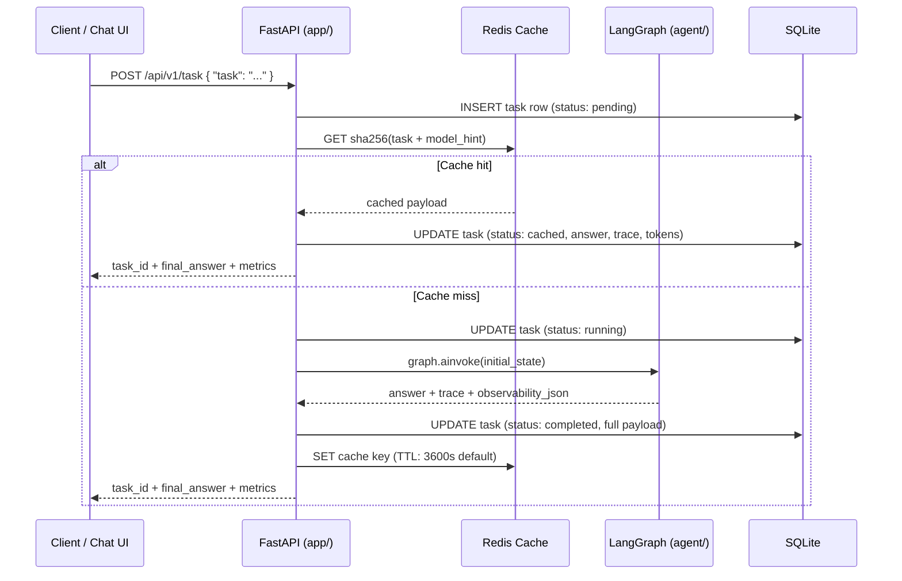
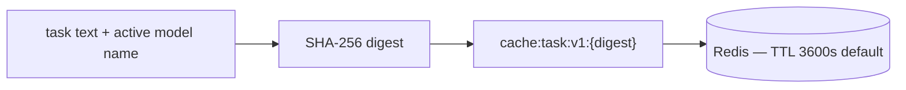

# System Design — API + Persistence + Cache

[← Component README](README.md) · [Code Design →](02-code-design.md)

---

## Request Lifecycle

---

## Endpoints

All routes are served under `/api/v1`.

| Method | Path | Description |
|--------|------|-------------|
| `POST` | `/task` | Submit a task. Returns `task_id`, `final_answer`, `latency_ms`, token totals. |
| `GET` | `/tasks/{id}` | Retrieve a past result. Returns the answer **plus full `observability`** blob (plan, results, trace, llm_calls, token totals). |
| `GET` | `/tasks/{id}/debug` | Returns a structured `reasoning_tree` — planner step, executor waves with per-tool timing, responder step. Used by the debug sidebar in the UI. |
| `GET` | `/health` | Reports SQLite, Redis, and agent graph status. Also shows active provider and model names per agent role. |
| `GET` | `/health/model` | Model warmup lifecycle: `not_started → downloading → warming_up → ready` (Ollama path). Returns `skipped` when warmup is not applicable (e.g. OpenAI). |

**Implementation:** `app/api/routes/task_management_routes.py` and `app/api/routes/health_check_routes.py` delegate to `app/services/task_orchestration_service.py` (`TaskOrchestrationService`) and `app/services/health_check_service.py` (`HealthCheckService`) respectively — see [Code Design](02-code-design.md). JSON field values such as overall `status` (`ok` / `degraded`) and per-component `sqlite` / `redis` / `agent` (`ok` / `error` / `skipped`) are **StrEnum**s in `app/types/health_status_types.py` (serialized as strings in responses).

Overall **`status` is `degraded`** when any of these hold: SQLite probe fails, LangGraph/config probe fails (`get_graph()` / `load_config()`), or Redis is configured (`REDIS_URL` non-empty) but the cache ping fails. The Chat UI maps `status !== "ok"` to a **Degraded** badge.

> `POST /task` is intentionally **slim** — it returns only the answer and metrics. Full trace and debug data are always accessible via the GET endpoints using the returned `task_id`.

---

## Persistence Model (SQLite)

Every task is stored as a single row in the `tasks` table.

| Column | Type | Contents |
|--------|------|----------|
| `id` | UUID | Primary key |
| `task_text` | TEXT | Original user input |
| `status` | ENUM | `pending · running · completed · failed · cached` |
| `final_answer` | TEXT | LLM-synthesized response |
| `trace_json` | JSON | Executor trace: one entry per tool call with `agent`, `status`, `duration_ms`, `wave` |
| `observability_json` | JSON | Full snapshot: context at start, plan, results, llm_calls, error details |
| `latency_ms` | INT | Wall-clock time for `graph.ainvoke` |
| `total_cached_tokens` | INT | Tokens from cached (system) prompts |
| `total_input_tokens` | INT | Tokens from dynamic (human) messages |
| `total_output_tokens` | INT | Tokens generated by the LLM |
| `error_message` | TEXT | Set on `failed` status only |
| `created_at` / `completed_at` | DATETIME | Timestamps |

The schema is migrated automatically via Alembic on every API startup (Docker-volume safe).

---

## Redis Cache Strategy

The model hint is included in the key so that switching models does not serve stale answers from a previous model.

If Redis is unreachable, the API continues with **cache miss behavior** when `REDIS_OPTIONAL=true` (the default for local development).

---

## Optional API Key Auth

If `API_KEY` is set in `.env`, all task routes require an `X-API-Key` header.  
If unset, routes are open — no auth is enforced.
