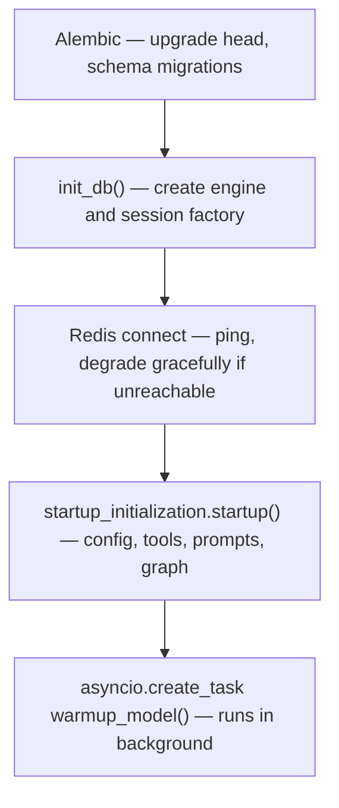
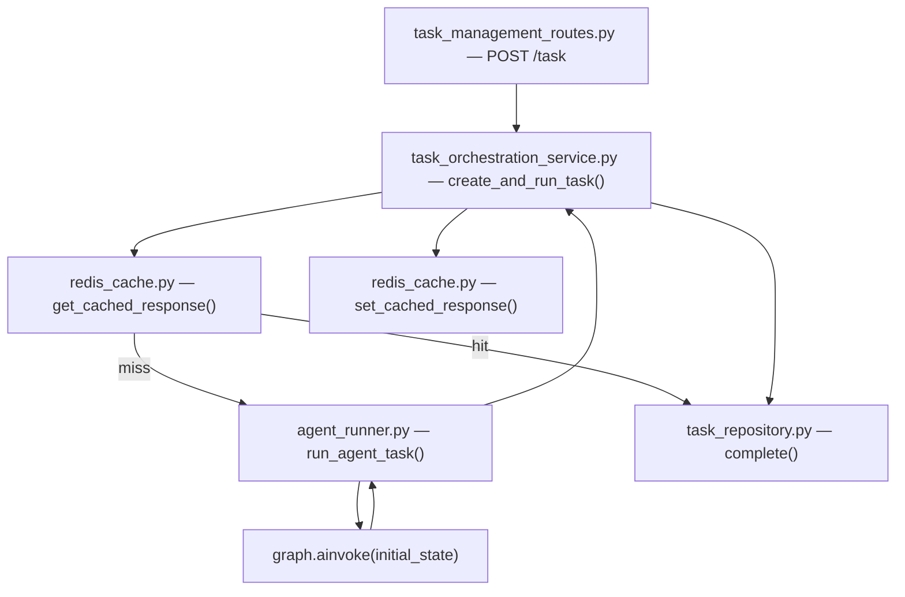
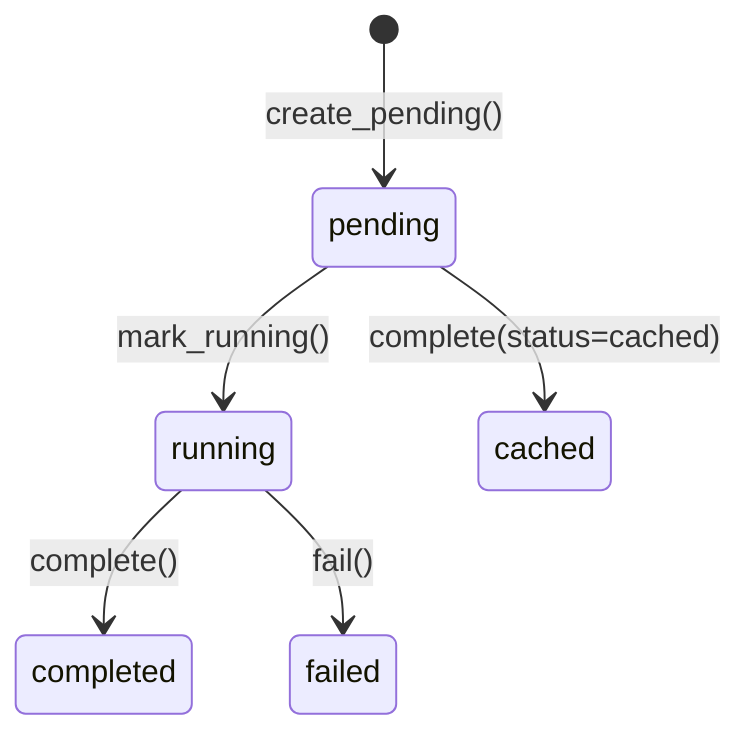
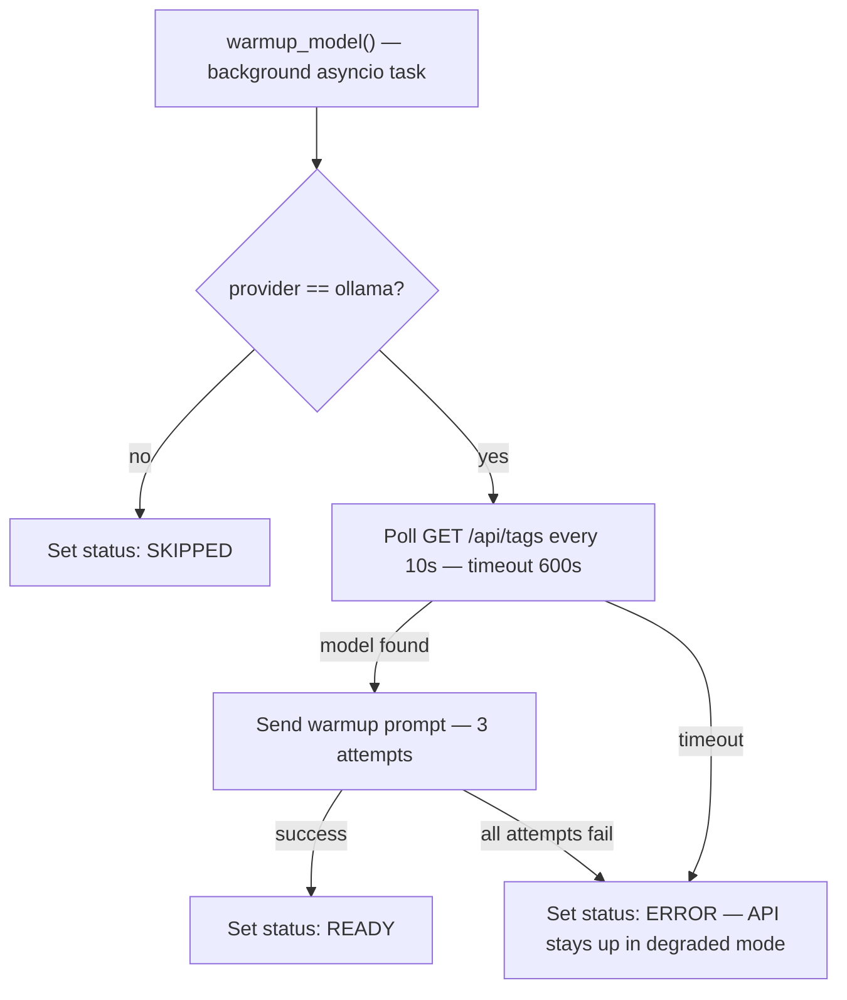

# Code Design — API + Persistence + Cache

[← Component README](README.md) · [← System Design](01-system-design.md) · [Folder Structure →](03-folder-structure.md)

---

## Startup (`app/main.py` lifespan)

On process start, the FastAPI `lifespan` context runs in this order:

---

## Request Flow Through the Code

---

## Task Repository States

---

## Agent Runner (`app/integrations/agent_runner.py`)

This module is the boundary between the API layer and LangGraph. It:

1. Resets the per-request token accumulator (`reset_usage()`)
2. Attaches conversation memory to the initial state
3. Calls `graph.ainvoke(initial_state)` with a recursion limit derived from `executor.max_waves`
4. Builds `observability_json` from the result state + token usage
5. Schedules background conversation summarization (non-blocking — runs after the HTTP response returns)

---

## Warmup Manager (`app/warmup/`)

Only active when `LLM_PROVIDER=ollama`. Runs in background after startup completes.

Status is exposed at `GET /api/v1/health/model` for the UI to poll.
