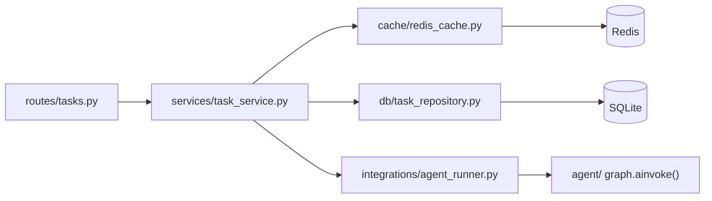

# Folder Structure — API + Persistence + Cache

[← Component README](README.md) · [← Code Design](02-code-design.md)

---

## `app/` Tree

```
app/
│
├── main.py                      ← FastAPI app factory + lifespan
│                                   (migrations · Redis · agent startup · warmup)
│
├── settings.py                  ← Pydantic Settings: DATABASE_URL · REDIS_URL · API_KEY
│                                   CORS_ORIGINS · CACHE_TTL_SECONDS · api_v1_prefix
│
├── dependencies.py              ← FastAPI DI: get_db() · get_task_service()
│
├── api/
│   └── routes/
│       ├── tasks.py             ← POST /task · GET /tasks/{id} · GET /tasks/{id}/debug
│       └── health.py            ← GET /health · GET /health/model
│
├── middleware/
│   ├── auth.py                  ← Optional X-API-Key verification
│   └── error_handler.py        ← Global exception handler → structured JSON errors
│
├── services/
│   └── task_service.py          ← Orchestration: DB row lifecycle + Redis + agent runner
│                                   Also builds reasoning_tree for debug endpoint
│
├── integrations/
│   └── agent_runner.py          ← Graph entry point: builds state, invokes graph,
│                                   assembles observability_json, schedules summarization
│
├── cache/
│   └── redis_cache.py           ← GET/SET with TTL · SHA-256 key builder · safe degradation
│
├── db/
│   ├── models.py                ← Task ORM model + TaskStatus enum
│   ├── task_repository.py       ← create_pending · mark_running · complete · fail · get_by_id
│   ├── session.py               ← Async engine + session factory
│   ├── migrate.py               ← Alembic upgrade head on startup
│   └── base.py                  ← SQLAlchemy declarative Base
│
├── warmup/
│   ├── manager.py               ← Poll Ollama /api/tags → send warmup prompt
│   ├── status.py                ← ModelStatus enum + thread-safe model_state singleton
│   └── __init__.py              ← Re-exports warmup_model · ModelStatus · model_state
│
├── schemas/
│   ├── task.py                  ← TaskRequest · TaskSubmitResponse · TaskDetailResponse
│   │                               TaskDebugResponse · ReasoningStep
│   └── health.py                ← HealthResponse · ModelStatusResponse
│
└── observability/
    ├── logging.py               ← Structured logging helpers
    └── tracing.py               ← Tracing hooks
```

---

## Key Data Flow Between Modules


