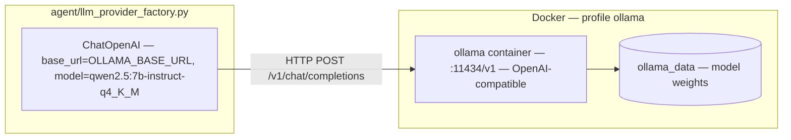
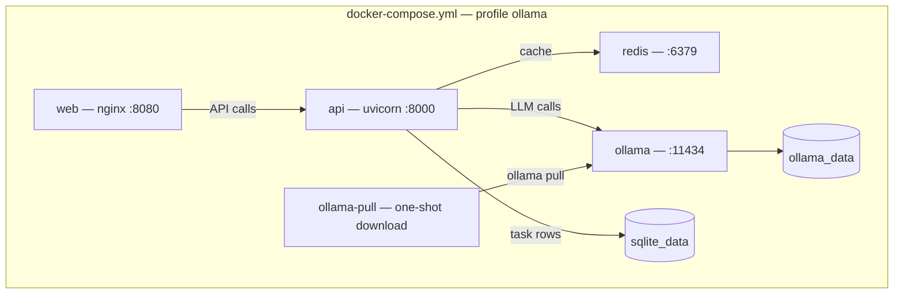
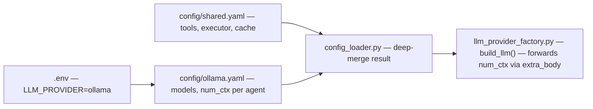

# System Design — Ollama Local LLM

[← Component README](README.md) · [Docker Setup →](02-docker-setup.md)

---

## How Ollama Plugs into the Stack

The agent uses LangChain's `ChatOpenAI` for all LLM calls. Ollama exposes an OpenAI-compatible API at `/v1`, so **zero agent code changes** are needed to switch providers.

The `base_url` resolves to `http://ollama:11434/v1` inside Docker (Compose service DNS) and `http://localhost:11434/v1` for local host development. Both are set via `OLLAMA_BASE_URL` in `.env`.

---

## Docker Service Topology

`ollama-pull` is a **one-shot** container — it runs once, downloads the model into the volume, and exits. It does not block the API from starting.

---

## Concurrency Control

Local inference is single-threaded by nature — concurrent LLM calls on a single GPU do not parallelize; they queue and create memory pressure.

This is handled by a semaphore in `agent/llm_provider_factory.py`:

| Provider | Semaphore limit | Reason |
|----------|----------------|--------|
| `openai` | 5 | External API can handle parallel requests |
| `ollama` | **1** | Single GPU — serialize LLM calls to avoid OOM |

The semaphore is held **only during LLM inference** and released before HTTP/computation work. This means API calls from multiple tools can still overlap even when LLM calls are serialized.

---

## Config Path for Ollama

The `num_ctx` value is forwarded to Ollama as `options.num_ctx` in the API request body — it is not a standard `ChatOpenAI` parameter. This is handled in `build_llm()` via `extra_body`.
