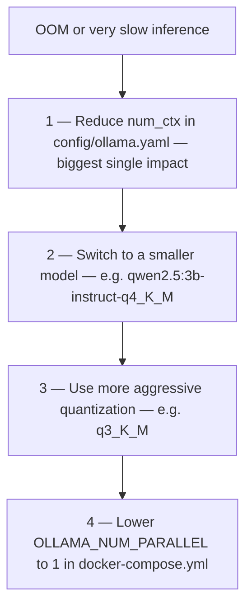

# Performance & Limits — Ollama Local LLM

[← Component README](README.md) · [← Docker Setup](02-docker-setup.md)

---

## Why Quantization Matters

The default model `qwen2.5:7b-instruct-q4_K_M` uses **4-bit quantization** (`q4`).

| Model format | VRAM (approx) | Quality trade-off |
|-------------|--------------|-------------------|
| `fp16` (full precision) | ~14 GB | Reference quality |
| `q8_0` (8-bit) | ~7 GB | Near-identical quality |
| **`q4_K_M` (4-bit)** | **~4–5 GB** | **Slightly lower, usually unnoticeable** |
| `q3_K_M` (3-bit) | ~3 GB | Noticeable degradation |

`q4_K_M` is the default because it fits on most consumer GPUs (6 GB VRAM) while retaining strong instruction-following ability.

---

## KV Cache is the Real Memory Cost

Model weights are a fixed cost. The **KV cache** grows with every token in the context window.

This project controls KV cache size via `num_ctx` in `config/ollama.yaml`:

```yaml
agents:
  planner:
    num_ctx: 4096   # caps KV cache for this agent
  responder:
    num_ctx: 4096
  weather:
    num_ctx: 4096
```

`num_ctx` is forwarded to Ollama as `options.num_ctx` in each API request — it is not a standard LangChain parameter. See `agent/llm_provider_factory.py :: build_llm()`.

---

## Docker-Level Tuning Knobs

These are set on the `ollama` service in `docker-compose.yml`:

| Variable | Value | Effect |
|----------|-------|--------|
| `OLLAMA_FLASH_ATTENTION` | `1` | Enables Flash Attention — faster and more memory-efficient |
| `OLLAMA_KV_CACHE_TYPE` | `q8_0` | Quantizes the KV cache itself (saves ~30–40% VRAM on cache) |
| `OLLAMA_NUM_PARALLEL` | `2` | Max concurrent inference slots (one per request slot) |
| `OLLAMA_MAX_LOADED_MODELS` | `1` | Only one model in VRAM at a time |
| `OLLAMA_KEEP_ALIVE` | `30m` | Keeps model loaded for 30 min after last request |
| `OLLAMA_GPU_OVERHEAD` | `1073741824` | Reserves ~1 GB VRAM headroom for OS/driver stability |

---

## If It Is Slow or Runs Out of Memory



---

## Verify GPU Is Being Used

After sending a request, run on the host:

```bash
nvidia-smi
```

During inference, the Ollama process should show non-zero GPU utilization and VRAM consumption.
