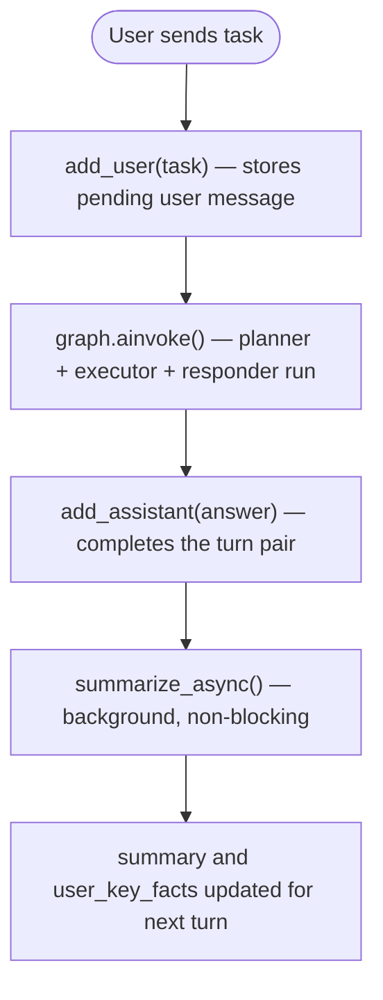
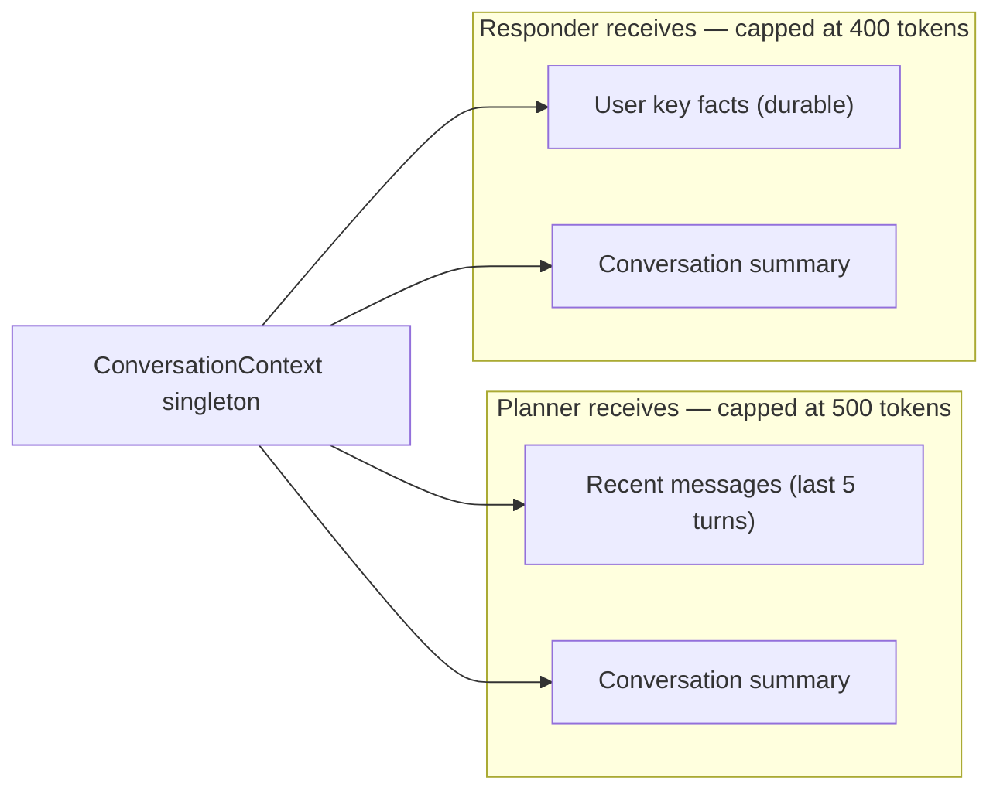

# Conversation Memory

[← Back](README.md)

---

## The Challenge

A plain stateless agent forgets every previous exchange. But users naturally follow up ("what was the weather you just found?" / "convert that to Celsius"). The memory system bridges that gap without dumping an ever-growing transcript into every prompt.

---

## Three Memory Slots

The `ConversationContext` object is a **process-level singleton** — shared across all requests. It is not part of `AgentState` (which is per-request). It holds three distinct slots:

| Slot | Content | How it grows |
|------|---------|-------------|
| **Recent messages window** | Last ≤ 5 user/assistant turn pairs | Rolling `deque(maxlen=5)` — oldest turn drops automatically |
| **Rolling summary** | LLM-generated prose summary of the full conversation | Overwritten after every turn by the summarizer |
| **User key facts** | Durable facts extracted from the user's messages (name, preferences, recurring topics) | Merged / deduped by the summarizer; survives summary rewrites |

---

## Lifecycle Per Turn



The summarizer runs **after** the response is returned to the user, so it never adds latency to the current request.

---

## What Gets Injected and Where

The two nodes that receive memory get **different slices** — tuned to what each node actually needs:



**Planner** gets recent messages so it can resolve "that" / "it" references when building the task plan.
**Responder** gets user key facts so the final answer can use the user's name and preferences even if those were mentioned many turns ago.

---

## Token Budget Enforcement

Both memory blocks go through `memory_budget_formatter.py` before injection. The formatter:

1. Assembles the block normally
2. Counts tokens via tiktoken
3. If over budget — iteratively trims the **summary first**, then the recent messages / facts
4. As a final fallback, hard-truncates to the budget limit

This prevents memory from crowding out the task text itself.

---

## The Background Summarizer

The summarizer makes a single LLM call with:
- The full recent-message window as a plain-text transcript
- The previous `user_key_facts` string (to merge, not replace)

It expects a JSON response:

```json
{
  "summary": "User has been asking about weather in European cities...",
  "user_key_facts": "Name: Alice. Prefers Celsius. Interested in travel."
}
```

If the LLM returns malformed JSON or the call fails, the previous summary and facts are kept unchanged.
