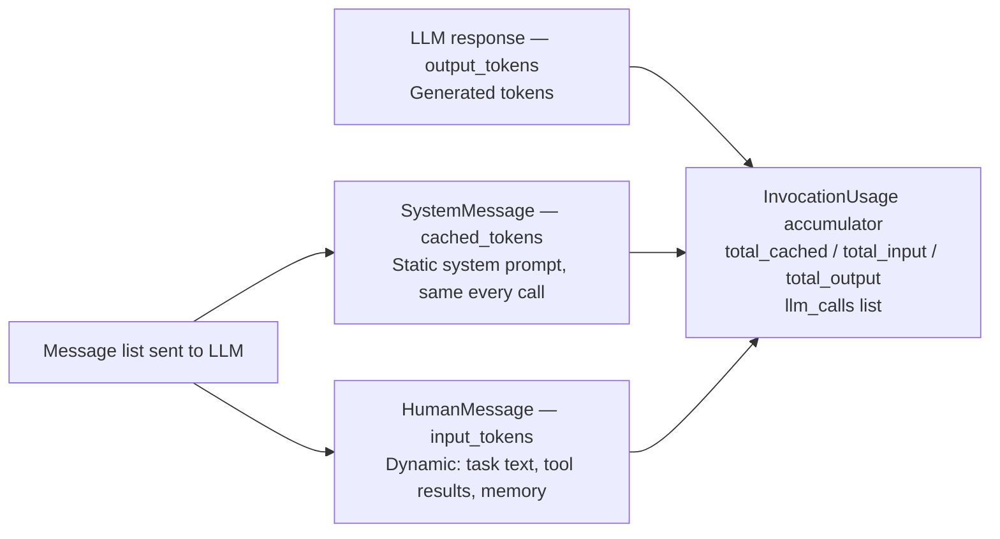
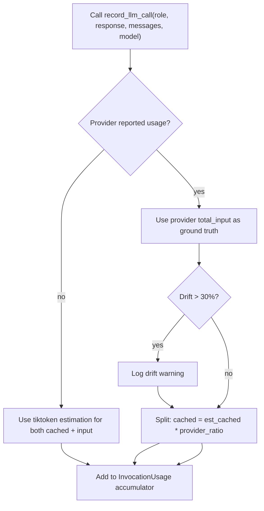
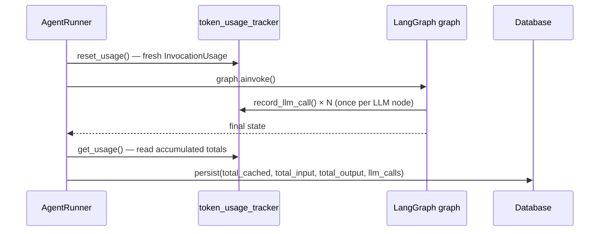

# Token Usage Tracking

[← Back](README.md)

---

## Why Track Tokens

Every LLM call has a cost — in money (OpenAI) or in time (Ollama). To understand what each task spends, every call is recorded with a **3-way split**: how many tokens were static/cached, how many were dynamic input, and how many were generated output.

This data is stored in the database per task and surfaced in the API response trace.

---

## The 3-Way Split



| Bucket | What goes in it |
|--------|----------------|
| `cached_tokens` | All `SystemMessage` content — the static planner/responder system prompts |
| `input_tokens` | All `HumanMessage` content — task text, memory block, tool results |
| `output_tokens` | Tokens generated by the model (completion) |

---

## Measurement Logic

For each LLM call, `record_llm_call()` does the following:



- **Provider wins** when it reports a total — tiktoken then allocates the cached/input split proportionally.
- **tiktoken is the fallback** when the provider omits usage metadata (common with Ollama).
- A **30% drift warning** is logged when the two estimates disagree significantly, helping catch misconfigured models.

---

## Per-Request Lifecycle

Token tracking is scoped to a single `graph.ainvoke()` call using a Python `ContextVar`. This makes it safe under concurrent requests with no shared state.



After the graph completes, the runner reads the accumulated `InvocationUsage` and stores it in the task record alongside the full trace.

---

## What the Trace Looks Like

Each LLM call appends an entry to `llm_calls`:

```json
{
  "role": "planner",
  "model": "gpt-4o-mini",
  "usage": {
    "cached_tokens": 312,
    "input_tokens": 88,
    "output_tokens": 145
  },
  "input_text": "...",
  "output_text": "..."
}
```

The per-task totals roll up all calls across planner, executor tool-LLMs, and responder into a single summary accessible via `GET /tasks/{task_id}`.
