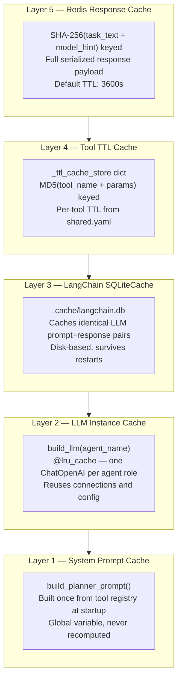
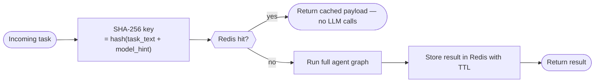

# Caching Layers

[← Back](README.md)

---

## Overview

The system has **five independent caching layers**, each targeting a different kind of repeated work. They stack from cheapest (sub-microsecond in-process reads) to most expensive (Redis network round-trip).



---

## Layer 1 — System Prompt Cache

**Where:** `agent/llm_system_prompts.py`  
**Scope:** Process lifetime (never invalidated)

The planner's system prompt is dynamically constructed from the live tool registry — it lists every registered tool's name, description, and parameter schema. Building this is O(tools) and always produces the same string once tools are registered at startup.

A module-level `_planner_cache: str | None` variable holds the result. First call builds it; every subsequent call returns the cached string. No TTL needed because tool registration is static.

---

## Layer 2 — LLM Instance Cache

**Where:** `agent/llm_provider_factory.py`  
**Scope:** Process lifetime (never invalidated)

```python
@lru_cache(maxsize=None)
def build_llm(agent_name: str) -> BaseChatModel:
    ...
```

Creating a `ChatOpenAI` or `ChatOllama` instance loads config, sets up HTTP connection pools, and wires retry logic. With `@lru_cache`, each `agent_name` key (e.g. `"planner"`, `"responder"`) gets exactly one instance for the life of the process. Concurrent requests share the same instance safely.

---

## Layer 3 — LangChain SQLiteCache

**Where:** `agent/tool_result_cache.py` → `init_llm_cache()`  
**Scope:** Disk — survives restarts  
**Config:** `cache.enabled` and `cache.llm_cache_path` in `shared.yaml`

LangChain's built-in `SQLiteCache` intercepts every `llm.invoke()` call. If the exact same message list has been sent before, the stored response is returned without calling the API.

This is particularly useful during development and testing: running the same prompt twice costs nothing after the first call.

```yaml
cache:
  enabled: true
  llm_cache_path: ./.cache/langchain.db
```

Set `enabled: false` to disable (e.g. in production where stale LLM responses are unacceptable).

---

## Layer 4 — Tool TTL Cache

**Where:** `agent/tool_result_cache.py` → `cached_call()`  
**Scope:** In-memory, per process, TTL-based  
**Config:** `cache.tool_ttls.*` in `shared.yaml`

Every tool call is wrapped in `cached_call()`. The cache key is `MD5(tool_name + sorted_kwargs)`. Results live in a plain dict with an expiry timestamp.

```yaml
cache:
  tool_ttls:
    calculator: 0      # math is deterministic — no TTL, no cache
    weather: 300       # 5 minutes
    web_search: 600    # 10 minutes
    unit_converter: 60 # 1 minute (currency rates shift)
    database_query: 120
```

Setting TTL to `0` bypasses caching entirely for that tool (used for `calculator` since the result is always derivable and caching adds no value).

---

## Layer 5 — Redis Response Cache

**Where:** `app/services/task_orchestration_service.py`  
**Scope:** External — shared across API workers, survives restarts  
**Config:** `REDIS_URL` in `.env`

This is the outermost layer. Before invoking the agent at all, `TaskOrchestrationService` checks Redis:



The cache key includes a `model_hint` so that the same task phrased for `gpt-4o` and `ollama` is cached separately.

Redis is **optional** — if `REDIS_URL` is not set, the service falls through to the agent for every request. No code path breaks without it.

---

## Cache Layer Summary

| Layer | Storage | Scope | Key | TTL |
|-------|---------|-------|-----|-----|
| System prompt | Process memory | Infinite | None (singleton) | None |
| LLM instance | Process memory | Infinite | `agent_name` | None |
| LangChain SQLite | Disk | Infinite | Hash of full message list | None |
| Tool TTL | Process memory | Per process | `MD5(tool + params)` | Per-tool (0–600s) |
| Redis response | Redis | Shared / multi-worker | `SHA-256(task + model)` | 3600s default |
