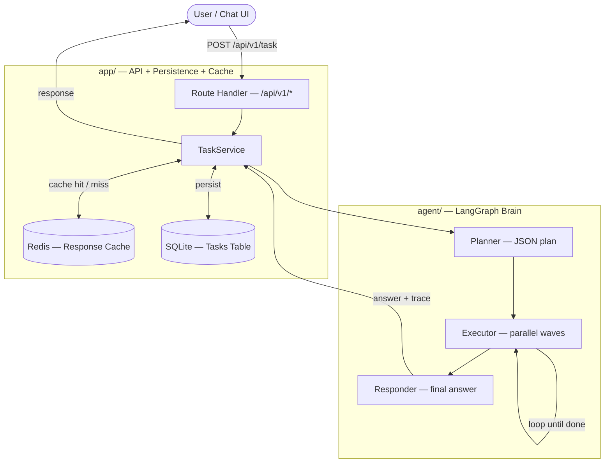

# Tufin Agent — System Documentation

---

## System Overview



---

## Components

| # | Component | Role | Code |
|---|-----------|------|------|
| 1 | [LangGraph Agent](01-langgraph-agent/README.md) | The **brain** — planner, parallel tool executor, responder. Plugin tool system with factory-driven configuration. | `agent/` |
| 2 | [API + Persistence + Cache](02-api-app/README.md) | The **product layer** — FastAPI endpoints, SQLite task persistence, Redis response cache, full observability trace. | `app/` |
| 3 | [Ollama Local LLM](03-ollama-local-llm/README.md) | The **local runtime** — runs the same agent with no external API key. Tuned for limited VRAM via quantization and context capping. | `config/ollama.yaml` + `docker-compose.yml` |
| 4 | [Memory, Token Usage & Caching](04-memory-and-caching/README.md) | The **context layer** — rolling conversation memory, 3-way token tracking, and five stacked cache layers from in-process to Redis. | `agent/conversation_memory.py` · `agent/token_usage_tracker.py` · `agent/tool_result_cache.py` |

---

## Repository Layout

```
tufin_agent/
│
├── agent/                   ← LangGraph brain (planner, executor, tools, memory)
├── app/                     ← FastAPI, SQLite, Redis, observability
├── config/
│   ├── shared.yaml          ← shared executor / tool / cache settings
│   ├── openai.yaml          ← OpenAI models + API key
│   └── ollama.yaml          ← Ollama models + num_ctx per agent
│
├── DOCS/                    ← this documentation
│   ├── README.md
│   ├── 01-langgraph-agent/
│   ├── 02-api-app/
│   ├── 03-ollama-local-llm/
│   └── 04-memory-and-caching/
│
├── chat-ui/                 ← Vite + React frontend (served by nginx in Docker)
├── tests/                   ← pytest suite
├── docker-compose.yml       ← full stack (Redis · API · UI · Ollama profile)
├── Dockerfile               ← API container
└── .env.example             ← all required env vars
```
