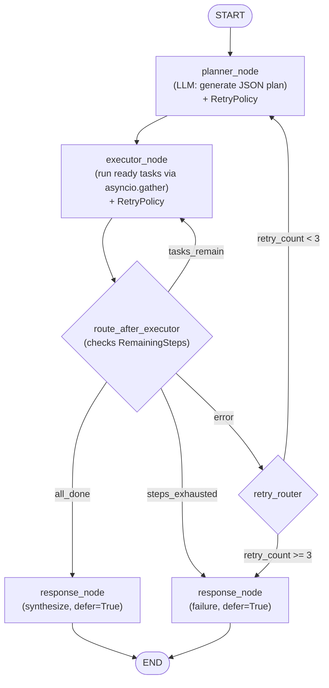
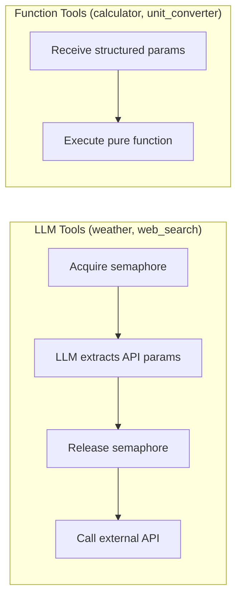

# Multi-Tool Agent — Full Implementation Plan

This plan implements the two-tier plan-and-execute agent engine described in [docs/superpowers/specs/2026-03-31-agent-architecture-design.md](docs/superpowers/specs/2026-03-31-agent-architecture-design.md), with the REST/persistence layer from [CLAUDE.md](CLAUDE.md).

**LangGraph version:** v1 LTS (stable release, `langgraph>=1.0.0`). Verified against official docs as of 2026-03-31. Core graph APIs (StateGraph, nodes, edges, reducers) are unchanged from pre-v1; v1 adds `Command`, `Runtime` context, built-in `RetryPolicy`, `CachePolicy`, `defer`, and `RemainingSteps`.

---

## Current State

The project is **empty** — no source code, no dependencies, no config files. Only documentation exists:

- `CLAUDE.md` (project overview)
- `AGENT_ARCHITECTURE_PROMPT.md` (brainstorm prompt)
- `docs/superpowers/specs/2026-03-31-agent-architecture-design.md` (resolved architecture — **authoritative spec**)

The `docs/project-instruction` folder (referenced in user rules) does **not exist yet** and must be created during implementation to document program flow.

---

## LangGraph v1 Compatibility Notes

The architecture spec was written against pre-v1 LangGraph. The following LangGraph v1 features are incorporated into this plan:

- `**StateGraph` + `TypedDict` + `Annotated` reducers** -- Fully compatible, no changes needed. This remains the recommended approach.
- `**RetryPolicy`** -- Added to `planner_node` and `executor_node` via `add_node(retry_policy=RetryPolicy())` as a safety net for transient network errors. This supplements (does not replace) the spec's manual retry loop, since our retry logic re-plans on error (not just re-runs the same node).
- `**Runtime[ContextSchema]`** -- Not adopted for Part 1. Our config is process-global via `load_config()` singleton. The `Runtime` pattern is better suited for per-request config (e.g., switching models per request), which we may adopt in Part 2.
- `**Command`** -- Available but not adopted for primary flow control. The spec's architecture uses conditional edges for explicit graph topology. `Command` would merge routing into nodes, making the graph structure less visible. Documented as an alternative.
- `**CachePolicy` + `InMemoryCache`** -- Not adopted for tool caching (our TTL cache operates at the API-call level inside tools, not at the node level). Could be added to `planner_node` for caching identical plan requests.
- `**defer=True`** -- Added to `response_node` to guarantee it waits until all executor waves complete before running.
- `**RemainingSteps`** -- Added to `AgentState` for proactive recursion handling. The executor routing function checks `remaining_steps <= 2` to force graceful termination instead of hitting `GraphRecursionError`.
- **Default recursion limit** -- Now 1000 in v1 (was 25). We set `recursion_limit` explicitly via config (`executor.max_waves * 3` as a reasonable bound).

---

## Target File Structure

```
tufin_agent/
├── config.yaml
├── .env.example
├── main.py                        # FastAPI app with lifespan
├── requirements.txt
├── agent/
│   ├── __init__.py
│   ├── config.py                  # load_config() with lru_cache
│   ├── llm.py                     # build_llm(), semaphore management
│   ├── prompts.py                 # PLANNER_SYSTEM, RESPONDER_SYSTEM, SUMMARIZER_SYSTEM
│   ├── state.py                   # AgentState TypedDict + reducers
│   ├── context.py                 # ConversationContext singleton
│   ├── graph.py                   # LangGraph compile + conditional edges
│   ├── nodes.py                   # planner_node, executor_node, response_node
│   ├── cache.py                   # Tool TTL cache + LangChain SQLiteCache
│   ├── startup.py                 # Ordered init sequence + validation
│   └── tools/
│       ├── __init__.py            # Autodiscovery loop
│       ├── base.py                # ToolSpec, BaseToolAgent, BaseFunctionTool, AgentRegistry
│       ├── calculator.py          # type: "function"
│       ├── weather.py             # type: "llm"
│       ├── web_search.py          # type: "llm" (Tavily)
│       └── unit_converter.py      # type: "function"
├── tests/
│   ├── __init__.py
│   ├── conftest.py
│   ├── test_graph.py              # End-to-end integration (>=5 assertions)
│   ├── test_calculator.py
│   ├── test_weather.py
│   ├── test_web_search.py
│   └── test_unit_converter.py
└── docs/
    └── project-instruction/
        ├── architecture-overview.md
        ├── program-flow.md
        └── tool-development-guide.md
```

---

## Architecture Overview




**Two tool subtypes:**




---

## Part 1 — Agent Execution Engine

### Phase 1: Project Scaffolding

- Create `requirements.txt` with pinned deps (latest versions, no made-up numbers -- use `pip install` to resolve):
  - `langgraph>=1.0.0` (v1 LTS)
  - `langchain-openai>=0.3.0`
  - `langchain-core>=0.3.0`
  - `langchain-community>=0.3.0`
  - `fastapi`, `uvicorn[standard]`
  - `aiohttp` (all HTTP calls -- no `requests`)
  - `pyyaml`, `python-dotenv`
  - `tavily-python` (web search)
  - `pytest`, `pytest-asyncio`
- Create `config.yaml` from the spec (provider, ollama/openai blocks, agents, tools, cache, executor, graph sections)
- Create `.env.example` with all required env vars: `OLLAMA_BASE_URL`, `OPENAI_API_KEY`, `WEATHER_API_KEY`, `TAVILY_API_KEY`, `EXCHANGE_API_KEY`
- Create empty `__init__.py` files for `agent/` and `agent/tools/` and `tests/`

### Phase 2: Core Infrastructure

`**agent/config.py**` — Config loader

- `load_config()` with `@lru_cache` — reads `config.yaml`, resolves `${ENV_VAR:-default}` patterns from `.env`
- Returns frozen dict structure

`**agent/llm.py**` — LLM abstraction

- `build_llm(agent_name)` with `@lru_cache` — sole `ChatOpenAI` instantiation point
- `init_llm_semaphore()` — called once at startup, sets `Semaphore(1)` for Ollama or `Semaphore(5)` for OpenAI
- `get_llm_semaphore()` — raises `RuntimeError` if not initialized

`**agent/cache.py**` — Caching layer

- In-memory `_cache` dict with TTL expiry
- `cached_call(fn, name, ttl, **kwargs)` — MD5-keyed, skips cache if `ttl == 0`
- LangChain `SQLiteCache` init for LLM response caching

`**agent/state.py**` — LangGraph state

- `AgentState(TypedDict)` with fields: `task`, `context_summary`, `plan`, `results`, `trace`, `response`, `retry_count`, `error_context`, `failure_flag`, `remaining_steps`
- Explicit reducer functions: `_merge`, `_append`, `_write_once` using `Annotated` types
- `remaining_steps: RemainingSteps` -- LangGraph v1 managed value for proactive recursion handling (not written by nodes; auto-populated by the runtime)

### Phase 3: Tool System

`**agent/tools/base.py**` — Base classes and registry

- `ToolSpec` dataclass: `name`, `type` (llm/function), `purpose`, `output_schema`, `input_schema` (function only), `system_prompt` (llm only), `default_ttl_seconds`
- `BaseToolAgent` — LLM tools base with retry loop (acquire semaphore -> LLM extract -> release semaphore -> API call)
- `BaseFunctionTool` — pure function base with `call(params)` abstract method
- `AgentRegistry` singleton with `register()` decorator, `get()`, and `planner_agent_block()` methods

`**agent/tools/__init__.py**` — Autodiscovery

- Imports all `.py` files in `agent/tools/` at startup (excluding `__init__.py` and `base.py`)
- `@register` decorators fire on import, populating the registry

`**agent/tools/calculator.py**` — Function tool

- `type: "function"`, pure math expression evaluator
- Uses `ast.literal_eval` or safe subset of Python math
- Input schema: `{"expression": str}`
- Output schema: `{"result": float}`
- Runs in `ThreadPoolExecutor` (CPU-bound)

`**agent/tools/weather.py**` — LLM tool

- `type: "llm"`, extracts city/units via its own LLM
- Calls weather API via `aiohttp` (wttr.in or WeatherAPI)
- Output schema: `{"temp_c": float, "temp_f": float, "condition": str, "city_name": str}`
- TTL: 300s

`**agent/tools/web_search.py**` — LLM tool (LangChain-native Tavily)

- `type: "llm"`, uses LangChain's prebuilt `TavilySearchAPIWrapper` for the API call
- Tool's own LLM extracts the search query from the natural language `sub_task` (per two-tier architecture)
- Semaphore held only during LLM extraction; released before calling Tavily wrapper
- Uses `from langchain_community.utilities.tavily_search import TavilySearchAPIWrapper` (async via `await wrapper.aresults(query)`)
- Output schema: `{"query": str, "results": list, "summary": str}`
- TTL: 600s

`**agent/tools/unit_converter.py**` — Function tool

- `type: "function"`, handles length/weight/temperature/currency
- Currency conversion via exchangerate-api.com (`aiohttp`)
- Input schema: `{"value": float, "from_unit": str, "to_unit": str}`
- Output schema: `{"result": float, "from_unit": str, "to_unit": str, "formula": str}`
- TTL: 60s

### Phase 4: Prompts and Context

`**agent/prompts.py**` — Static system prompts

- `_build_planner_system()` — reads from populated `agent_registry`, builds tool list block
- `PLANNER_SYSTEM` — module-level constant, frozen after import
- `RESPONDER_SYSTEM` — synthesize tool results into natural language
- `SUMMARIZER_SYSTEM` — compress conversation history to 2-3 sentences
- **Rule:** `SystemMessage` = fixed content only; all dynamic content goes in `HumanMessage`

`**agent/context.py`** — Conversation context manager

- Process-lifetime singleton (not per-request)
- `deque(maxlen=5)` for human and AI messages
- `window()` — interleaved chronological message list
- `summarize_async(llm)` — fire-and-forget after each response
- `conversation_context` module-level singleton

### Phase 5: Graph Nodes

`**agent/nodes.py`** — Three core nodes + routing functions

- `**planner_node(state)`** — Invokes planner LLM with `PLANNER_SYSTEM` + dynamic `HumanMessage` (task + context_summary + error_context if retrying). Parses JSON plan via `json.loads()` only. Returns `{"plan": parsed_tasks}`.
- `**executor_node(state)`** — Finds ready tasks (all deps in `results`). Runs them via `asyncio.gather(*[run_one(t) for t in ready], return_exceptions=True)`. Routes LLM tools through `agent.run()` and function tools through `agent.call()`. Collects results and trace entries. On error: returns `{"error_context": str, "retry_count": 1}`. All `llm.ainvoke()` and API calls wrapped in `asyncio.wait_for(timeout=...)`.
- `**route_after_executor(state)`** — Routing function for conditional edge. Checks: (1) `state["remaining_steps"] <= 2` -> force END via response (LangGraph v1 `RemainingSteps`), (2) any errors -> retry router, (3) tasks remain -> loop back to executor, (4) all done -> response.
- `**response_node(state)**` — Invokes responder LLM with `RESPONDER_SYSTEM` + all results + trace. If `failure_flag` is True, returns polite error message. Returns `{"response": answer}`. Added with `defer=True` (LangGraph v1) to guarantee it runs only after all parallel branches complete.

`**agent/graph.py`** — LangGraph v1 compilation

- `StateGraph(AgentState)` with nodes added via `add_node`:
  - `planner_node` -- with `retry_policy=RetryPolicy(max_attempts=2)` for transient network errors
  - `executor_node` -- with `retry_policy=RetryPolicy(max_attempts=2)` for transient network errors
  - `response_node` -- with `defer=True` to guarantee all executor waves complete first
- Edges:
  - `START` -> `planner_node` (entry point)
  - `planner_node` -> `executor_node` (normal edge)
  - Conditional edge after executor: routing function checks `state["remaining_steps"] <= 2` for graceful termination, then `tasks_remain` -> executor loop, `error` -> retry router, `all_done` -> response
  - Retry router: `retry_count < max_retries` -> planner (re-plan), else -> response (with `failure_flag=True`)
  - `response_node` -> `END`
- `compile()` returns the runnable graph
- Explicit `recursion_limit` set at invocation: `graph.ainvoke(state, config={"recursion_limit": cfg["executor"]["max_waves"] * 3})`
- Key LangGraph v1 imports: `from langgraph.graph import StateGraph, START, END`, `from langgraph.types import RetryPolicy`, `from langgraph.managed import RemainingSteps`

### Phase 6: Startup and Main

`**agent/startup.py`** — Ordered initialization

- Enforces import order: config -> tools autodiscovery -> prompts -> llm -> semaphore -> context -> graph
- `validate_config()` — checks required env vars, provider value, agent configs
- `startup()` — single entry point called from `main.py` lifespan

`**main.py`** — FastAPI stub (Part 1 minimal)

- FastAPI app with lifespan calling `startup()`
- Single `/health` endpoint
- Single `/task` POST endpoint (invokes graph, manages conversation context lifecycle)
- All `llm.ainvoke()` and `_call_api()` wrapped in `asyncio.wait_for(timeout=cfg["executor"]["tool_timeout_seconds"])`

### Phase 7: Tests

`**tests/conftest.py`** — Shared fixtures (mock LLM, mock aiohttp, test config)

`**tests/test_calculator.py`** — Basic math, edge cases, error handling

`**tests/test_weather.py`** — Mock API response, output schema validation

`**tests/test_web_search.py**` — Mock Tavily, result structure

`**tests/test_unit_converter.py**` — Temperature, length, weight, currency conversions

`**tests/test_graph.py**` — End-to-end integration (minimum 5 assertions):

- Calculator basic math -> result contains expected number
- Parallel routing -> plan has 2 tasks with `depends_on: []`
- Sequential routing -> t2 `depends_on: ["t1"]`
- Error recovery -> `retry_count > 0`, polite response
- Context carryover -> 2nd request references 1st, planner sees `[Conversation context]`
- Chained tasks -> calculator + unit_converter produce correct result

---

## Part 2 — REST API, Database, Docker (Future)

These are **not yet specified** in a detailed design doc. High-level scope from `CLAUDE.md`:

- **REST API**: `POST /task`, `GET /tasks/{task_id}`, `GET /health` with full FastAPI routes in `app/api/`
- **Database**: SQLite + SQLAlchemy, persist all task results and traces, models in `app/db/`
- **Observability**: Log latency and token usage per task, structured trace storage
- **Docker**: `Dockerfile` + `docker-compose.yml`, service fully runnable via Docker
- **Optional**: Simple frontend, `database_query` tool, multi-turn via persistent context

---

## Hard Constraints Checklist

These must be verified at every phase:

- No `requests` library — `aiohttp` only for HTTP
- No `time.sleep()` — `await asyncio.sleep()` only
- Planner output parsed via `json.loads()` — no regex
- All `run()`/`call()` return `dict` with schema fields
- `num_ctx` set explicitly in config
- `SystemMessage` is always a module-level constant
- Executor uses `asyncio.gather()` — never sequential awaits
- Semaphore released before API call
- Every result in `trace[]`
- `provider` is `"ollama"` or `"openai"` only
- `build_llm()` is the sole `ChatOpenAI` instantiation point
- No Anthropic support

---

## Documentation Deliverables

Create `docs/project-instruction/` folder with:

- `**architecture-overview.md`** — Two-tier design, graph flow, tool subtypes
- `**program-flow.md`** — Request lifecycle (API -> context -> graph -> planner -> executor waves -> response -> context update -> summarize)
- `**tool-development-guide.md`** — How to add a new tool (one file + config block pattern)

Update these files as each phase completes.